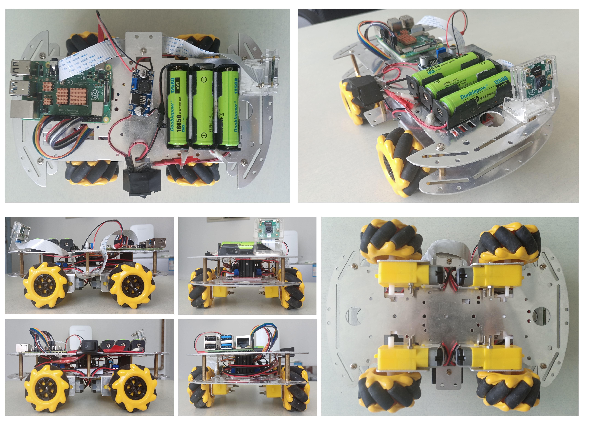

# Pi-SLAM

Implementing an active monocular visual SLAM on the Raspberry Pi 4B

## Introduction

This is a monocular vision active SLAM project based on ORB-SLAM2. Our aim is to develop a set of active SLAM mobile robot platform for monocular vision, including software and hardware implementation.

### Software

Our software platform is built on ORB-SLAM2. Based on its original composition, we added the Controller thread and the accompanying 2DMap data structure for active control of the cart's motion.

Our platform is built on the Raspberry Pi 4B Raspbian 10 buster system. In addition to ORB-SLAM2 and its dependent open source libraries, we use wiringPi to drive the motors.

### Hardware

Our hardware platform is a McNamee wheel omnidirectional AGV. Its control unit is a Raspberry Pi 4B. four independent motors drive the four McNamee wheels, allowing it to move forward, backward, left, right, and rotate. The AGV is powered by three lithium batteries on board, and a step-down module converts about 12V to 5V to meet the power supply needs of different components.

Our camera module uses the RaspBerry Pi Camera v2, the standard version of the RaspBerry Pi original 2nd generation camera, which contains an 8 megapixel Sony IMX219 sensor and connects to the RaspBerry Pi via a dedicated CSI interface to provide 3280 × 2464 resolution images without separate power supply. The camera's specific parameters are: CMOS size of 1/4 inch, aperture (F) of 2.0, focal length of 3.04 mm, and a diagonal field of view (FOV) of 62.2°.

## Installation

The system build for this project includes both hardware and software parts. For the hardware part, besides Raspberry Pi 4B, many other supporting hardware are needed, such as car body frame, battery pack, DC step-down module, signal level conversion module and so on. The specific choice of these hardware is not strict, as long as it can serve the purpose. If you need detailed information about this part, please contact the author via [weixr0605@sina.com](weixr0605@sina.com).

The software part is more complicated to build. Broadly speaking, it is divided into three parts: camera and motor debugging, compilation and installation of open source libraries (mainly OpenCV and ROS), and compilation of project code. See [Install-record.pdf](notes/Install-record.pdf) for the specific build process.

## Run

If all hardware and software are debugged correctly, the entire system can be booted with just one command:

    sudo su −c start_slam.sh

If it runs properly, using the command 'rosnode list' , you will see three nodes: Mono, rosout, usb_cam. Also 4 windows will be displayed at the same time: 3D feature point map (which comes with ORB-SLAM2), 2D map (generated by our system), camera live screen, and the original terminal.

## Results

Our system consists of two main parts: active map building before completing the closed loop, and active revisiting after completing the closed loop. The purpose of active map building is to control the AGV to complete monocular vision closed-loop map building with as little loss of tracking as possible. The purpose of active revisit is to increase the view angle by re-observing the map points with large optimization errors, thus reducing the local errors.

In order to guide and plan path for AGVs, we have to generate 2D obstacle maps from 3D feature point maps. Our approach is to simply project the feature points onto the horizontal plane and perform some filtering operations to reject the noise.The following figure shows the comparison between the 2D map and the 3D map.

The active map building method yields a closed-loop map. The following figure shows the comparison between the 2D closed-loop map we built and the actual scene.

The figure below shows how we actively control the AGV to revisit the map and reduce local errors. The green and red lines are the planned path and the actual path executed by the AGV, respectively. The different color temperatures of the map represent the magnitude of the errors.

## Contact Author

Contact me via [weixr0605@sina.com](weixr0605@sina.com).